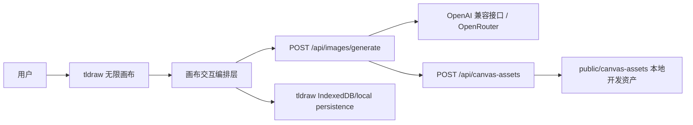
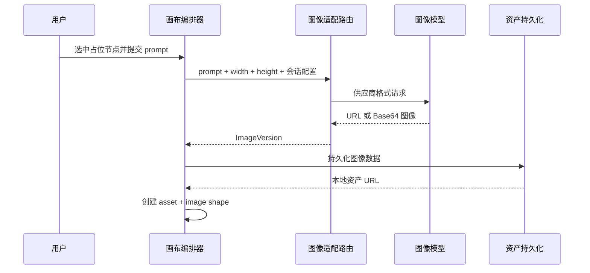

# 技术实现方案

## 1. 目标与范围

阿水画布将图像生成与修改流程放在一个无限画布中。系统的核心不是对话消息列表，而是可定位、可组织、可追溯的图像节点和批注节点。

当前实现覆盖：

- 生图占位节点创建与尺寸同步。
- 提示词生图与生成状态管理。
- 图片上的结构化批注。
- 基于原图和批注的版本生成。
- 图片资产本地持久化与画布状态持久化。

## 2. 系统架构



### 前端画布层

`src/components/canvas/ai-canvas.tsx` 是主编排器，负责：

- 持有 tldraw `Editor` 引用。
- 识别当前选中的占位节点、生成图片或批注。
- 将生成结果转换为 tldraw image asset 和 image shape。
- 在图片和批注之间维护元数据关系。
- 根据画布空闲区域放置新版本，避免覆盖现有节点。

### 交互面板层

- `canvas-toolbar.tsx`：创建节点、创建 AI 批注和会话级 API 配置。
- `generation-panel.tsx`：尺寸输入、提示词、生成操作和状态反馈。

### 服务端适配层

`src/app/api/images/generate/route.ts` 是模型适配器：

1. 校验 Base URL、API Key、模型和尺寸。
2. 识别 OpenRouter 或通用 OpenAI-compatible Images API。
3. 为 OpenRouter 映射最接近的受支持宽高比。
4. 组合原图、原始意图与局部批注提示词。
5. 兼容 URL、Base64、`data`、`images`、`output` 和 `choices` 等常见响应结构。
6. 返回统一的 `ImageVersion` 数据。

## 3. 画布数据模型

业务身份存放在 tldraw shape/asset 的 `meta` 中，避免依赖显示文本或节点名称。

### 图片占位节点

```ts
{
  kind: "image-holder",
  asuiNode: "image-holder",
  asuiMetaVersion: 1
}
```

### 生成图片节点

```ts
{
  kind: "generated-image",
  asuiNode: "generated-image",
  asuiMetaVersion: 1,
  versionId: "version-...",
  parentVersionId: "version-..." | null
}
```

### 批注节点

批注通过 `sourceShapeId` 显式指向目标图片。如历史数据没有该字段，系统会根据批注边界框与图片附近区域的相交关系进行回退匹配。

## 4. 生图数据流



## 5. 批注精确修改策略

局部改图请求包含：

- 原图数据或可访问 URL。
- 原始图像意图。
- 批注文本。
- 原版本 ID 和目标尺寸。

服务端提示词会强调：

- 只修改批注指定的部分。
- 保留未标注区域的主体、构图、视角、光线、色彩和排版。
- 移除箭头、标签、选中框和界面控件等批注痕迹。
- 只输出干净的修改后图像。

这是「输入约束 + 模型能力」的组合方案，精确程度最终取决于所选模型是否具备参考图编辑能力。

## 6. 密钥与安全边界

### 当前本地开发模式

- API Key 仅存在标签页 `sessionStorage`。
- 页面启动时会删除旧版本在 `localStorage` 中的配置。
- Key 只发送给同源 `/api/images/generate`，由路由代理到模型供应商。
- 代码库不包含默认 Key、`.env.local` 或生成图片。

### 公网部署的必要加固

当前路由是为本地单用户工具设计的。如果部署到公网，应在对外开放前完成：

1. 把 API Key 放入服务端密钥管理或非 `NEXT_PUBLIC_` 环境变量。
2. 为生图路由增加用户鉴权、配额与费用控制。
3. 增加请求体大小限制、频率限制和供应商白名单。
4. 不在客户端、响应体或日志中输出 Key。
5. 将生成资产从本地文件系统迁移到对象存储，并使用授权 URL。

## 7. 持久化

- 画布文档：tldraw persistence key 保存到浏览器本地存储。
- 图像版本：开发环境写入 `public/canvas-assets`，该目录已在 Git 中忽略。
- 版本关系：通过 `versionId` 和 `parentVersionId` 建立。

## 8. 测试策略

- `geometry.test.ts`：节点相交、空闲区域寻址。
- `size.test.ts`：尺寸正规化和边界值。
- `api-config.test.ts`：API 配置解析与密钥遮罩。
- `poster-generator.test.ts`：本地演示生成器。
- `route.test.ts`：图像模型响应兼容与资产持久化。

发布前质量门禁：

```bash
npm run lint
npm test
npm run build
```

## 9. 后续演进

- 显式的局部遮罩层与 mask 图生成。
- 多模型供应商适配器接口。
- 云端项目、多人协作与版本历史。
- 对象存储、签名 URL 与异步生成任务。
- 成本、配额、超时、重试和可观测性。
